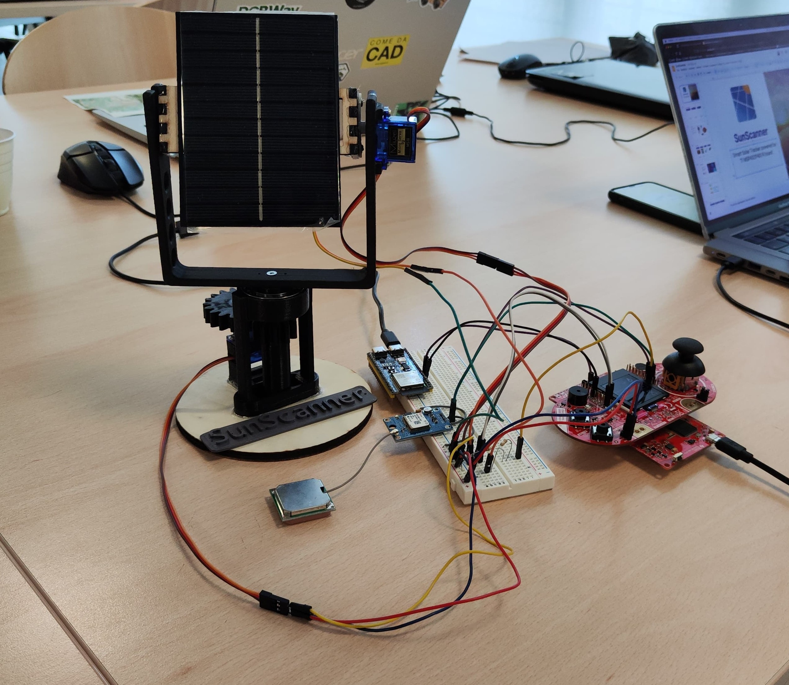
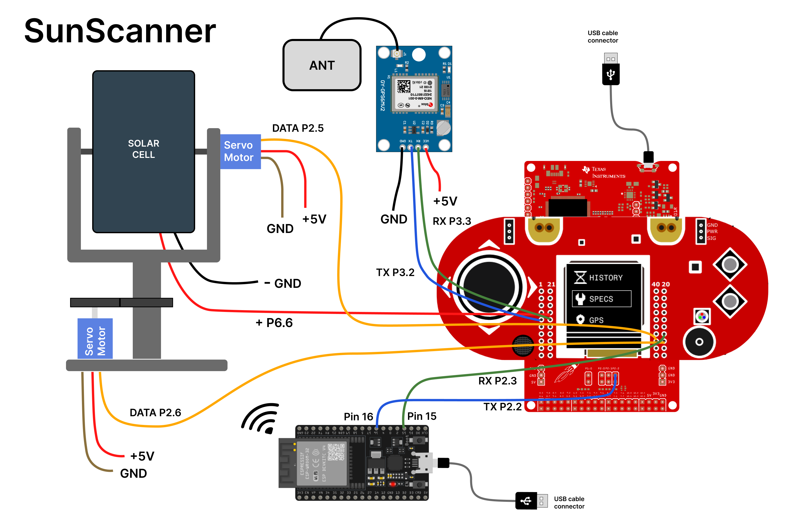

# SunScanner
<div align='center'>  </div>

Introducing SunScanner, a TI MSP432-powered smart device that tracks the sun to harvest solar energy.
It uses the GPS coordinates to understand the sun positioning in every place in the entire word.

This project is developed by a team of three students of the University of Trento, in the context of the course of Embedded Systems and IoT.


## Index Folder

- [Feauteres](#feauteres)
- [System Requirements](#system-requirements)
- [Schematic Project](#schematic-project)
  -  [Pin Scheme](#pin-scheme)
  -  [Project Layout](#project-layout)
- [Demo video](#demo-video)
- [Presentation](#presentation)
- [Gruoup members](#group-members)
- [Credits](#credits)


## Features

- Global Positioning System: to set automatically the solar cell directly the sun
- 2x Gear box: For increase the movement of servo to 180 degree to 360
- Possibility to manually adjust the position of the Solar Cell
- View in Real - Time Voltage catch the sun through the Solar Cell


## System Requirements

- Texas Instruments MSP432 - P401R
- BoosterPack MKII
- 2x Servo Motors MS18
- GPS Ublox neo 6m
- CCS - Code Composer Studio

## Schematic Project
 </div>

### Pin Scheme
|component|port|pin|
|--|--|--|
|Servo_PWM|2|5
|Servo_PWM|2|6|
|Voltage|6|6|
|GPS|3|2/3|
|ESP32_|15|16|
|_ESP32|P2.3|P2.2|


### Project Layout
```
├── README.md
└── MSP432
   └── SunScanner
       └──libs
          └──gps
             ├── gps.h
             └──NMEAparser.h
          └──servo
             ├── servo_control.h
             ├── servo_sun_tracker.h
             └──Sun_az_alt.h
          ├── menu.ino
          ├── finite_state_machine.h
          ├── delay.h
          └── scenes.h
       └──libs
          └──servo
             └──Sun_az_alt.c
          ├── menu.ino
          ├── finite_state_machine.h
          ├── delay.h
          └── scenes.h
```


## Demo Video

[Sun Scanner](https://youtu.be/7Bo-yUQaSLg)

## Presentation
[Link Presentation](https://docs.google.com/presentation/d/1R6tl_jSoiLLPsk6RGqctIMuoVqyj2pdu-Sd7vOVIlfg/edit?usp=sharing)

## Group members
|Name|Email|
|--|--|
|Alessandro Bianchi Ceriani|a.bianchiceriani@studenti.unitn.it|
|Gerardo Chianucci|gerardo.chianucci@studentu.unitn.it|
|Daniele Visentin|daniele.visentin@studenti.unitn.it|

## Credits

[Conversion .png to HEX](https://nununoisy.github.io/JSFormer/)

